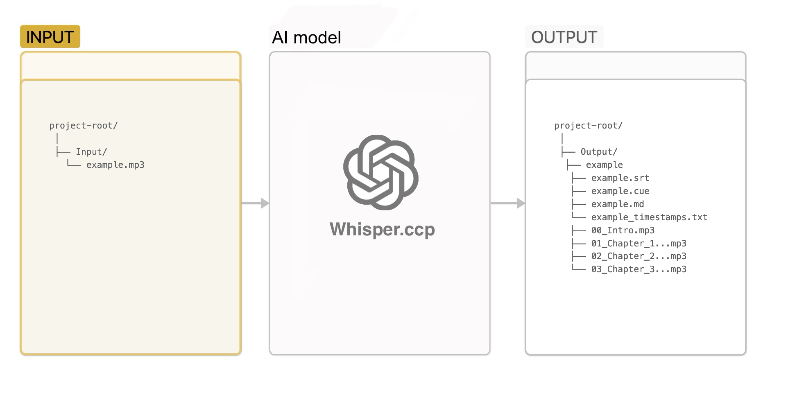

# Whisper Audiobook Chapterizer

This script is designed to split an audiobook into chapters based on detected chapter headings in the audio. It uses the extremely fast `whisper.cpp` model for transcription and `ffmpeg` for audio processing on Apple silion.



## Features

- Transcribes audio files to text using the `whisper.cpp` model (default `large-v3-turbo`)
- Detects chapter headings in the transcribed text.
- Splits the audio file into separate chapters.
- Generates output files including SRT, CUE, Markdown, and raw text with timestamps.

## System requirements
- Tested only on Mac os
- Procesor Apple silicon (M1/M2/M3)

## Requirements

- Python 3.x
- `ffmpeg`
- `mutagen`
- `pywhispercpp`

## Installation & usage

1. Clone the repository:
2. Install the required Python packages:
   ```bash
   pip install -r requirements.txt
3. Place your MP3 files in the `Input/` directory.
4. Run the script:
   ```bash
   python Splitter.py
   ```
## Customization

- **Skip Phrases**: You can customize the phrases to skip when detecting chapters by editing the `skip_phrases.json` file.

## License

This project is licensed under the MIT License. See the [LICENSE](LICENSE) file for details.

## Acknowledgments

- [whisper.cpp](https://github.com/ggerganov/whisper.cpp) for the transcription model.
- [FFmpeg](https://ffmpeg.org/) for audio processing.